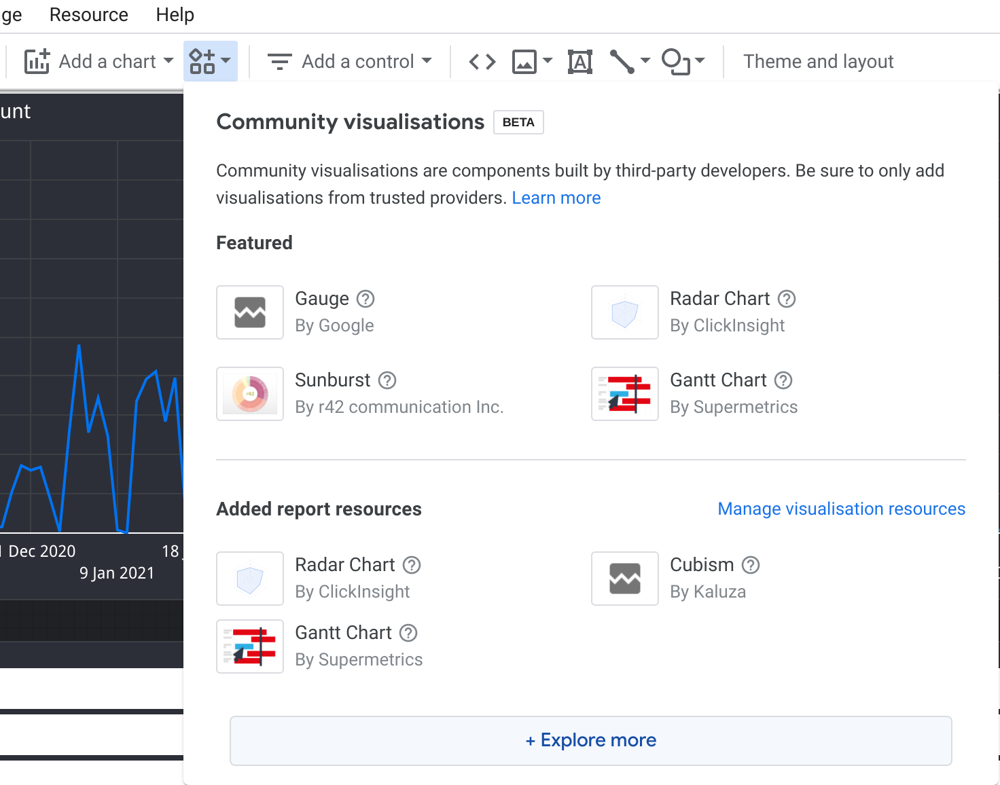
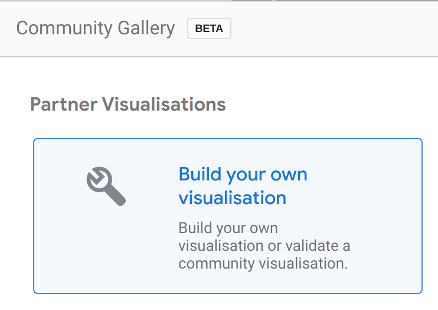
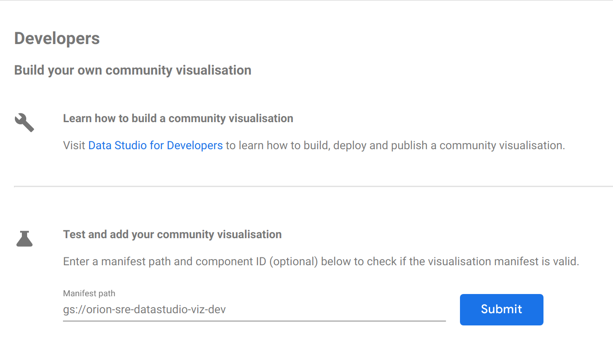
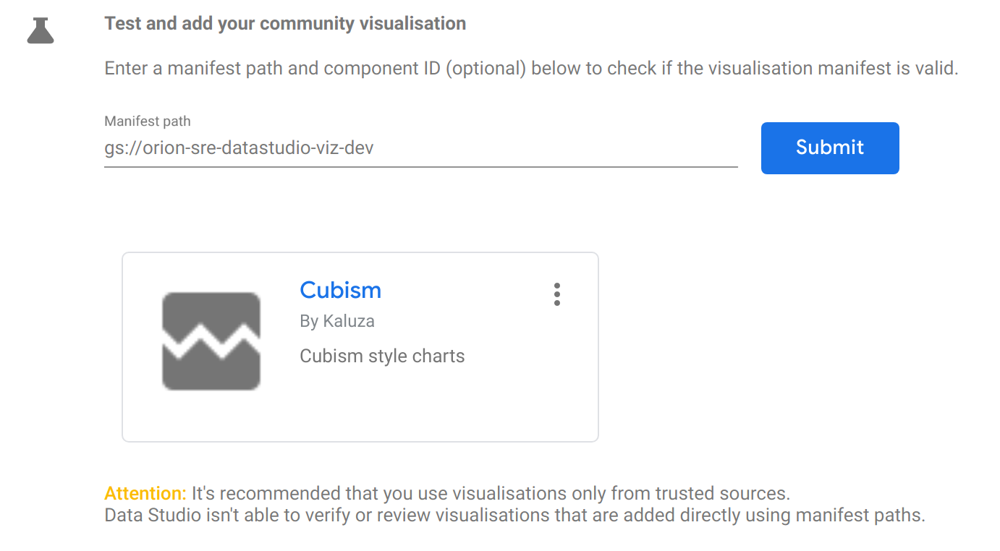
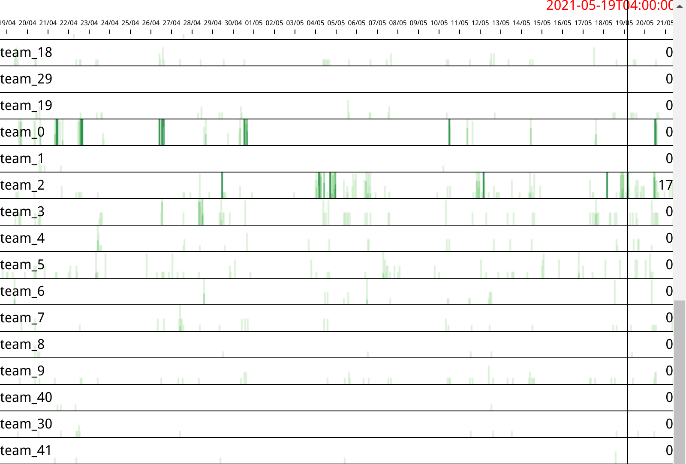

# Kaluza's DataStudio Community Visualizations

## What lives here?
Kaluza have built some Community Visualizations for DataStudio

## How can I use these in my DataStudio project?
Within DataStudio do the following:
1. Click Add Community Visualization, then Explore More
   
1. Click Build your own visualization
   
1. Enter our manifest path: ```gs://orion-sre-datastudio-viz-dev``` and click Submit
   
1. Click on the visualization you wish to add
   

## How can I develop visualizations locally?
Firstly you will need to install all dev packages:
```
npm install --dev
```
There are some useful GNU Make targets for the development flow:
```
make dev        - Spin up a dev server with Hot Reload
                  (should automagically open the index page - http://localhost:8080/)
make test       - Run jest tests
make upload     - Build and upload distribution files to orion-sre-datastudio-viz-dev
make flow       - Run flow static type checker
make css-types  - Generate *.scss.d.ts Typescript Module Interfaces for .scss sources.
```

## What visualizations are available?

### Cubism

See [Time Series Visualization with Cubism.js](https://bost.ocks.org/mike/cubism/intro/#0) for an introduction to Cubism / Horizon charts
